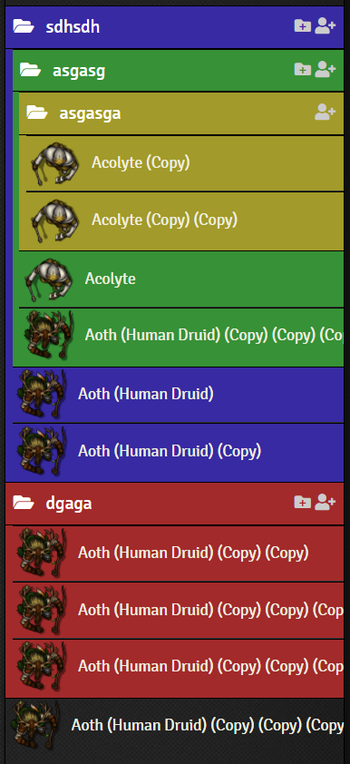

# Colored Folder Contents
A simple module to apply folders' background colors to their contents.

# Install instructions
This Package can be installed from within Foundry VTT or manually via the following Manifest URL:

    https://github.com/Rayuaz/colored-folder-contents/releases/latest/download/module.json

# Screenshots

